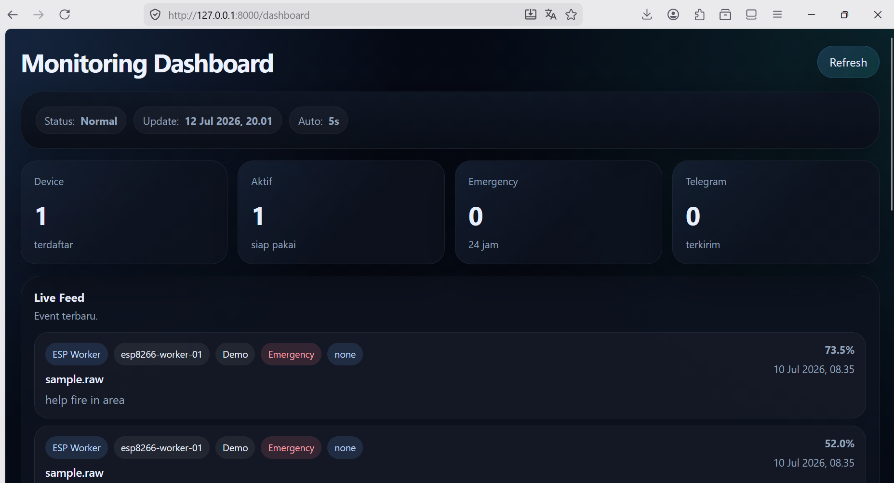
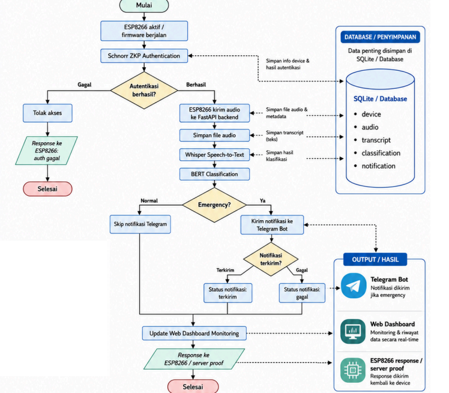
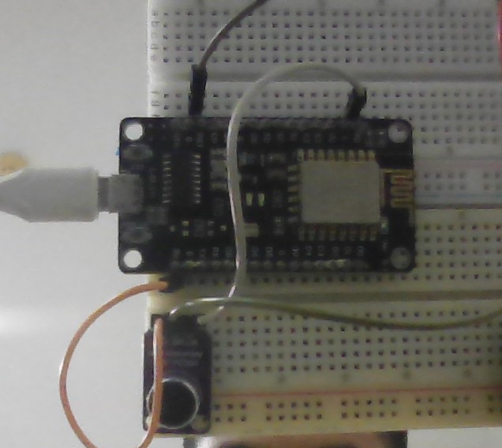

# VoiceGuard-ZKP

Sistem deteksi kondisi darurat berbasis suara yang menggabungkan ESP8266, autentikasi Schnorr Zero-Knowledge Proof, Whisper untuk speech-to-text, BERT untuk klasifikasi, Telegram untuk notifikasi cepat, dan dashboard web untuk monitoring.

## Overview

- Device ESP8266 mengirim audio setelah autentikasi berhasil
- Backend FastAPI memproses audio dan menyimpan hasil analisis
- Whisper mengubah audio menjadi teks
- BERT menentukan apakah pesan masuk kategori `Emergency` atau `Normal`
- Telegram dikirim saat kondisi darurat terdeteksi
- Dashboard web menampilkan perangkat aktif dan event terbaru

## Visual Documentation

### Dashboard



### Flowchart



### Prototype



## Project Structure

```text
backend/
  api/              FastAPI router, schemas, and dependencies
  auth/             Challenge-response auth, token, and middleware
  zkp/              Schnorr parameters, challenge generator, verifier, validator
  speech/           Whisper speech-to-text service
  bert/             HuggingFace BERT classification service
  telegram/         Telegram notification service
  database/         SQLAlchemy engine, session, and Base
  models/           SQLite ORM models
  repositories/     Data access layer
  services/         Application use cases
  utils/            Logging, exception handler, filesystem helpers
  uploads/          Stored audio files
  logs/             Application logs
firmware/esp8266/   PlatformIO firmware for NodeMCU ESP8266
dataset_ml/         Cleaned datasets for training
tests/              Pytest test suite
```

## Core Features

- Schnorr authentication for ESP8266
- Audio upload and server-side proof generation
- Whisper transcription
- BERT text classification
- Telegram emergency alert
- Web monitoring dashboard
- SQLite-based persistence for devices, audio, transcript, classification, and notification

## Installation

Use Python 3.12.

```bash
python -m venv .venv
.venv\Scripts\activate
pip install -r requirements.txt
copy .env.example .env
```

Whisper requires `ffmpeg` to be available in `PATH`.

## Configuration

Edit `.env` with your environment values:

```text
DATABASE_URL=sqlite:///./backend/database/app.db
UPLOAD_DIR=backend/uploads
LOG_DIR=backend/logs
TELEGRAM_BOT_TOKEN=
TELEGRAM_CHAT_ID=
EMERGENCY_THRESHOLD=0.8
WHISPER_MODEL_NAME=base
WHISPER_LANGUAGE=
WHISPER_DEVICE=cpu
BERT_MODEL_NAME=bert-base-uncased
BERT_DEVICE=cpu
BERT_EMERGENCY_LABELS=Emergency,EMERGENCY,LABEL_1
BERT_NORMAL_LABELS=Normal,NORMAL,LABEL_0
```

For the ESP8266 demo, register the device using public key `9` if `DEVICE_SECRET_KEY=5` in the firmware.

## Run Backend

```bash
uvicorn backend.main:app --reload
```

Swagger UI:

```text
http://127.0.0.1:8000/docs
```

Main endpoints:

```text
GET  /api/health
POST /api/devices
POST /challenge
POST /verify
POST /api/process/audio
GET  /dashboard
GET  /api/monitoring/overview
GET  /api/monitoring/events
```

## Run ESP8266

Firmware source for Arduino IDE:

```text
firmware/esp8266/esp8266_emergency_detector.ino
```

Steps:

1. Open `firmware/esp8266/include/config.h`
2. Fill `WIFI_SSID`, `WIFI_PASSWORD`, and `SERVER_BASE_URL`
3. Make sure Schnorr parameters match the backend
4. Build and upload with PlatformIO

```bash
cd firmware/esp8266
pio run --target upload
pio device monitor
```

## Dataset

Prepared training datasets are stored in `dataset_ml/`.

Recommended format for training:

```text
text,label
help fire in area,Emergency
everything is normal,Normal
```

## Testing

Run the test suite with:

```bash
pytest
```

Tests cover:

- Schnorr proof verification
- Auth token flow
- Health endpoint
- OpenAPI route availability
- ML pipeline using fake Whisper, fake BERT, and fake Telegram

## Production Notes

The current Schnorr parameters are for prototype use only. For production, use reviewed large cryptographic parameters, secure secrets, HTTPS, token rotation, a fine-tuned BERT model, and stronger audio validation.

## Repository Upload Notes

If you want a clean GitHub upload flow, see:

```text
docs/guides/upload-github.md
```

And if you need runtime instructions:

```text
docs/guides/running-project.md
```
